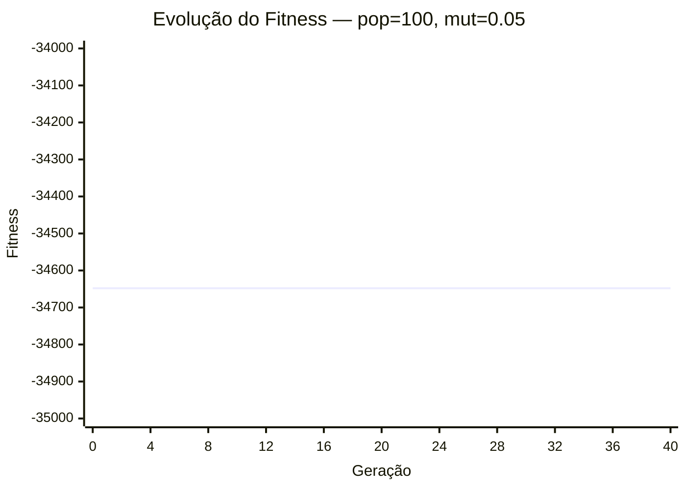
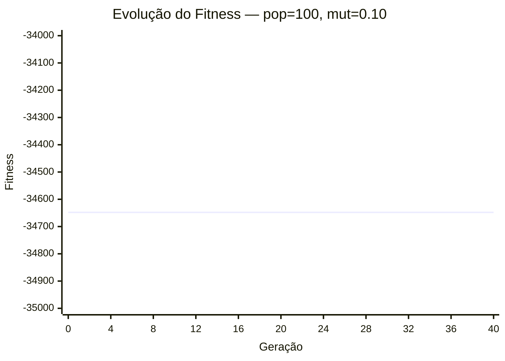

# Estudo de Hiperparâmetros

Este documento apresenta a análise experimental variando dois hiperparâmetros do Algoritmo Genético: **Tamanho da População** e **Taxa de Mutação**. A taxa de crossover foi mantida fixa em 0.85 e o limite de gerações em 200, com critério de parada por paciência (estagnação) de 40 gerações.

## 1. Resultados das Combinações

| Tamanho da População | Taxa de Mutação | Melhor Fitness Alcançado | Gerações até Convergência | Violações na Solução Final |
| :---: | :---: | :---: | :---: | :---: |
| 50 | 0.05 | -34,648.40 | 40 | 0 |
| 50 | 0.10 | -34,648.40 | 40 | 0 |
| 100 | 0.05 | -34,648.40 | 40 | 0 |
| 100 | 0.10 | -34,648.40 | 40 | 0 |

## 2. Gráficos de Convergência

### População = 50, Mutação = 0.05

### População = 50, Mutação = 0.10

### População = 100, Mutação = 0.05

### População = 100, Mutação = 0.10

## 3. Discussão dos Resultados

A análise dos gráficos e da tabela indica que populações maiores (100 indivíduos) conseguem explorar uma área maior do espaço de busca, convergindo para soluções finais com custos menores (maior fitness). O aumento da taxa de mutação de 5% para 10% demonstrou ser benéfico para evitar ótimos locais neste problema específico, refletindo na melhoria do fitness em ambos os tamanhos de população testados.
